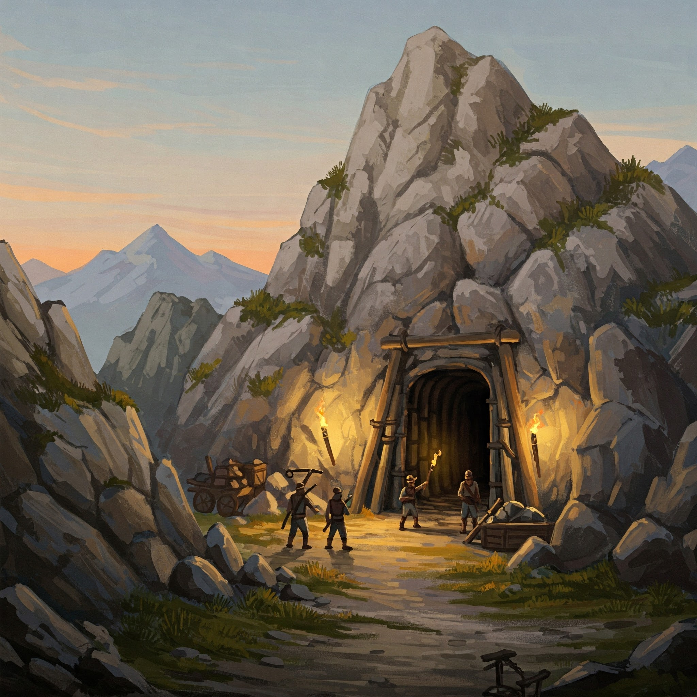

# Siedler von Catan: Deck Building
University of Applied Sciences Lucerne

Autoren: Nicola Hermann, Luca Kyburz

Siedler von Catan: Deck Building ist ein Deck Building Spiel, das stark vom klassischen Brettspiel Siedler von Catan inspiriert ist. Im Gegensatz zum Original geht es also nicht darum auf einem Spielbrett möglichst viele Siedlungen und Städte zu bauen, sondern sich ein Deck mit möglichst starken Karten zusammenzustellen, um so als erster die Siegesbedingungen zu erfüllen.

Anzahl Spieler: 2

# Ziel des Spiels
Im Spiel stellst du dir dein eigenes Deck zusammen. Dieses Deck stellt dein Reich dar und besteht aus Ressourcen-, Gelände- & Aktionskarten. Die Spieler beginnen mit einem kleinen Startdeck, welches alle Kartentypen beinhaltet, allerdings nur wenige Aktionskarten. Im Verlauf des Spiels wächst dieses Deck immer weiter an und ermöglicht dem Spieler mehr und mächtigere Aktionen.

Der Spieler der als erster während seinem Zug drei Städte (Aktionskarte) auf der Hand hat beendet und gewinnt das Spiel.

# Spielmaterial
<!-- Anzahl Spieler: 2
Karten:
- Weide: 6x
- Getreide: 6x -->

## Kartenübersicht

### Resourcenkarten
Es gibt Insgesammt 5 verschiedene Ressourcenkarten. Diese werden nur für den Kauf von Aktionskarten verwendet und haben keine weiteren funktionen. Es können keine weiteren Ressourcenkarten im Verlauf des Spiels dazugekauft werden:

| Erz (E) | Lehm (L) | Getreide (G) | Holz (H) | Weide (W) |
| --- | --- | --- | --- | --- |
|  |  |  |  |  |

### Geländekarten
Geländekarten sind grösstenteils unnütze Karten, die das Deck verschlechtern. Es können keine weiteren Geländekarten im Verlauf des Spiels dazugekauft werden.Es gibt 2 Geländekarten.

| Meer | Wüste |
| --- | --- | 
|  |  |
| Nur nützlich in kombination mit einem Hafen | Muss auf der Hand sein, um einen Banditen zu kaufen |

### Aktionskarten
Als Aktionskarten werden alle Karten bezeichnet, die man aus dem Vorrat kaufen kann. Sie haben alle spezielle Effekte und kosten Ressources um sie aus dem Vorrat zu erwerben.

| Karte | Beschreibung |
| --- | --- |
|**Bandit** |  |
|  | **Kosten**: 2x Weide, 1x Getreide  **Kurzbeschrieb**: +1 Karte, Klaue eine Handkarte des Gegners und lege diese auf deinen Ablagestapel.  **Beschreibung**: Ziehe eine Karte von deinem Nachziehstapel. Bitte deinen Gegner seine Handkarten aufzufächern. Ziehe nun eine zufällige Handkarte deines Gegners. Schaue dir die Karte an und entscheide, ob du diese auf Deinen Ablagestapel legen möchtest oder diese deinem Gegner zurück geben willst.  |
| **Ritter (Defensiv)** |  |
|  | **Kosten**: 1x Weide, 1x Getreide, 1x Holz  **Kurzbeschrieb**: +1 Karte, Reflektiere einen Angriff deines Gegners  **Beschreibung**: Wenn dein Gegner einen Angriff (Ritter (Offensiv) oder Bandit) ausspielt kannst du diese Karte vorzeigen. Ziehe dann eine Karte von deinem Nachziehstapel und führe den reflektierten Angriff auf deinen Gegner aus. Falls dieser auch einen Ritter (Defensiv) vorzeigt, hat der Angriff auf keinen Spieler einen Einfluss. Ein Ritter (Defensiv) kann nur einen einzelnen Angriff abblocken. Falls der Ritter (Defensiv) keinen Angriff abgeblockt hat, kann dieser benutzt werden um eine Karte vom Nachziehstapel zu ziehen.  |
| **Ritter (Offensiv)** |  |
|  | **Kosten**: 1x Weide, 1x Getreide, 1x Erz  **Kurzbeschrieb**: +1 Karte, Dein Gegner muss 2 beliebige Karten ablegen.  **Beschreibung**: Ziehe eine Karte von deinem Nachziehstapel. Dein Gegner muss 2 Karten, die dein Gegner selbst aussuchen kann, auf seinen Ablagestapel ablegen. Es können mehrere Ritter (Offensiv) in einem Zug ausgespielt werden. |
| **Hafen** |  |
|  | **Kosten**: 2x Lehm, 1x Holz  **Kurzbeschrieb**: +1 Karte, für jedes Meer: +1 Karte  **Beschreibung**: Zeige alle deine Meere und Str vor. Falls du eine oder mehrere Strassen besizt, zählen diese als insgesammt 1 Meer (Siehe Strasse). Ziehe nun 1 + Anzahl Meere Karten von deinem Nachziehstapel. Beispiele:   1) Hafen ohne Strassen oder Meere -> +1 Karte   2) Hafen ohne Strassen mit 2x Meere -> +3 Karten   3) Hafen mit 1x Strasse und 2x Meere -> +4 Karten   4) Hafen mit 3x Strassen und 2x Meere -> +4 Karten   Falls mehrere Häfen in einer Runde ausgespielt werden können die Meere mehrmals gezählt werden.
| **Strasse** |  |
|  | **Kosten**: 1x Lehm, 1x Holz  **Kurzbeschrieb**: Gibt einen besseren Effekt, je mehr Strassen man gleichzeitig auspielt  **Beschreibung**:   1x Strasse -> 1 Meer   2x Strassen -> 1 Meer, 1 Ressource nach Wahl  3x Strassen -> 1 Meer, 3 Ressourcen nach Wahl  Für jede weitere Strasse -> +2 Ressourcen nach Wahl |
| **Siedlung** |  |
|  | **Kosten**: 1x Lehm, 1x Weide, 1x Getreide, 1x Holz  **Kurzbeschrieb**: 2 beliebige Ressourcen  **Beschreibung**: Zählt als 2 Ressourcen nach Wahl. Diese könne 2 unterschiedliche Resourcen sein. Die Siedlung wird benötigt um eine Stadt zu erwerben. Die Aktion der Siedlung kann nicht verwendet werden, um eine Stadt zu erwerben (Die Siedlung muss noch unausgespielt auf der Hand sein. Die Siedlung wird danach zurück auf den Vorrat gelegt). |
| **Stadt** |  |
|  | **Kosten**: 3x Erz, 2x Getreide, 1x Siedlung  **Kurzbeschrieb**: 2 beliebige Ressourcen  **Beschreibung**: Zählt als 3 Ressourcen nach Wahl. Diese könne 3 unterschiedliche Resourcen sein. Die Stadt wird benötigt um das Spiel zu gewinnen. Die Aktion der Siedlung kann nicht verwendet werden, um eine Stadt zu erwerben (Die Siedlung muss noch unausgespielt auf der Hand sein. Die Siedlung wird danach zurück auf den Vorrat gelegt). |

## Spielfeld
Als Spielfeld kann jegliche Unterlage verwendet werden. Diese wird in der Vorbereitung und im Verlauf des Spiels mit Karten belegt, wie in der folgenden Abbildung ersichtlich.

### 1) Nachziehstapel
Der verdeckte Nachziehstapel von dem neue Handkarten nachgezogen werden.

### 2) Handkarten
Die eigenen Karten, die während des eigenen Zugs verwendet werden können, um Aktionen auszuführen. Der Gegner soll keine Einsicht in diese Karten haben.

### 3) Ablagestapel
Auf diesen Stapel werden am Ende des Zugs alle verwendeten Handkarten abgelegt.

### 4) Vorrat
In der Tischmitte befindet sich der Vorrat aller Aktionskarten. Von hier können neue Aktionskarten gekauft werden.

# Vorbereitung
Vor dem Spielbeginn müssen die Startdecks erstellt und der Vorrat vorbereitet werden.

## Startdecks erstellen
Ein Startdeck besteht aus den folgenden Karten:

| Karte | Anzahl |
| --- | --- |
| Getreide | 3 |
| Holz | 3 |
| Weide | 3 |
| Lehm | 2 |
| Erz | 2 |
| Meer | 3 |
| Wüste | 1 |
| Strasse | 2 |
| Siedlung | 2 |
| **Total** | **21** |

Bereitet das Startdeck pro Spieler folgt vor:
1. Suche die Karten gemäss obiger Tabelle heraus.
2. Mische die Karten.
3. Lege das gemischte Startdeck als Nachziehstapel vor dir ab.

## Vorrat
Der [Vorrat](#4-vorrat) besteht aus den folgenden Karten:

| Karte| Anzahl |
| --- | --- |
| Bandit | 3 |
| Ritter (Offensiv) | 3 |
| Ritter (Defensiv) | 3 |
| Strasse | 18 |
| Hafen | 3 |
| Siedlung | 12 |
| Stadt | 12 |
| **Total** | **54** |

Bereitet den Vorrate wie folgt vor:
1. Sucht die Karten gemäss obiger Tabelle heraus.
2. Bildet pro Kartentyp einen Stapel.
3. Legt die sieben Stapel offen in die Tischmitte (Siehe [Spielfeld](#spielfeld) als Beispiel).

# Spielablauf
## Spielbeginn
Nun da die Vorbereitungen getroffen wurden, kann das Spiel beginnen. Dazu ziehen beide Spieler zuerst 7 Karten vom [Nachziehstapel](#1-nachziehstapel). Der Spieler, der das Spiel bisher weniger häufig gespielt hat beginnt das Spiel. Haben beide das Spiel gleich häufig gespielt, beginnt der jüngste Spieler mit dem ersten [Spielzug](#spielzug).

## Spielzug
Während seines Spielzugs kann der Spieler [Karten kaufen](#karten-kaufen), [Handeln](#handel), [Aktionen ausführen](#aktionen-ausführen) und [Karten ablegen](#karten-ablegen). Immer wenn eine [Handkarte](#2-handkarten) für eine dieser Optionen verwendet wird, wird diese vor dem Spieler auf den Tisch gelegt und kann nach Gebrauch nicht ein zweites Mal verwendet werden (Bis auf erwähnte Ausnahmen). Die genannten Optionen können in beliebiger Reihenfolge durchgeführt werden.

### Karten kaufen
Durch das Ausspielen von [Resourcenkarten](#resourcenkarten), [Aktionskarten](#aktionskarten) die Resourcen geben und teilweise [Geländekarten](#geländekarten) können Karten die im [Vorrat](#4-vorrat) verfügbar sind gekauft werden. Die Karten die für den Kauf benötigt werden, werden vor dem Spieler auf den Tisch gelegt, bleiben aber in seinem Besitz (mit Ausnahme beim Kauf einer Stadt). Die gekaufte Karte wird dann direkt auf den [Ablagestapel](#3-ablagestapel) gelegt.

#### Beispiel
Der Spieler hat folgende [Handkarten](#2-handkarten): 1x Holz, 1x Lehm, 1x Siedlung, 1x Strasse und möchte eine weitere Siedlung kaufen. Er legt die Siedlung und die Holz- und Lehmkarte vor sich auf den Tisch. Die Resourcen der Siedlung verwendet er als eine Weide und ein Getreide. Er hat also 1x Holz, 1x Lehm, 1x Weide und 1x Getreide vor sich auf dem Tisch liegen. Dafür nimmt er sich eine neue Siedlung aus dem [Vorrat](#4-vorrat) und legt diese auf seinen [Ablagestapel](#3-ablagestapel). Er kann die Karten Siedlung, Holz und Lehm in diesem Zug nicht mehr verwenden und lässt sie vor sich liegen, bis der Zug beendet ist (Siehe [Ende des Spielzugs](#ende-des-spielzugs)). 

### Handel
Falls der Spieler nicht die passenden Resourcen hat, um eine [Karte zu kaufen](#karten-kaufen), kann er zwei beliebige [Resourcenkarten](#resourcenkarten) temporär als eine Resource von einem anderen Typ verwenden ("Handeln") um damit eine Karte zu kaufen.

#### Beispiel
Der Spieler hat folgende [Handkarten](#2-handkarten): 2x Getreide, 2x Erz, 2x Weide, 1x Siedlung und möchte die Siedlung zu einer Stadt aufwerten. Er legt die Getreide, Erz und Weide Karten vor sich ab und teilt dem Mitspieler mit, dass er 2x Weide für 1x Erz eintauscht. Damit hat er Karten im Wert von 2x Getreide und 3x Erz vor sich liegen und kann die Siedlung die noch in den [Handkarten](#2-handkarten) ist, zu einer Stadt aufwerten. Dazu legt er die Siedlung zurück in den [Vorrat](#4-vorrat) und nicht sich dafür eine Stadt.

### Aktionen ausführen
Nebst den [Aktionskarten](#aktionskarten) die hauptsächlich zum [Karten kaufen](#karten-kaufen) verwendet werden, können während einem Spielzug auch jegliche anderen [Aktionskarten](#aktionskarten) abgelegt werden und deren Beschriebene Aktion durchgeführt werden.

#### Beispiel
Der Spieler hat folgende [Handkarten](#2-handkarten): 1x Bandit, 1x Ritter (Defensiv), 1x Ritter (Offensiv), 1x Hafen. Er legt den Banditen vor sich ab und zieht eine Karte von seinem [Nachziehstapel](#1-nachziehstapel). Danach zieht er eine zufällige Handkarte des Gegners. Diese Handkarte kann er dann entweder auf seinen [Ablagestapel](#3-ablagestapel) legen oder dem Gegner zurückgeben. Der Bandit ist nun nicht mehr verfügbar und bleibt vor dem Spieler liegen, bis der Zug beendet ist (Siehe [Ende des Spielzugs](#ende-des-spielzugs)).

### Karten ablegen
Jegliche Karten können vor dem Spieler abgelegt werden, ohne eine bestimmte Aktion durchzuführen. Damit kann Platz geschaffen werden für's [Karten nachziehen](#karten-nachziehen).

### Ende des Spielzugs
Der Spielzug ist beendet, sobald der Spieler sich entscheidet [Karten nachzuziehen](#karten-nachziehen). Zuerst werden alle abgelegten Karten auf den [Ablagestapel](#3-ablagestapel) gelegt, dann wird nachgezogen. Sobald der Spieler fertig nachgezogen hat, beginnt der andere Spieler seinen [Spielzug](#spielzug).

#### Karten nachziehen
Es werden immer mindestens 3 Karten vom [Nachziehstapel](#1-nachziehstapel) gezogen. Hat der Spieler jedoch weniger als 4 Karten auf der Hand, zieht er Karten, bis er wieder 7 [Handkarten](#2-handkarten) hat.

Wenn der [Nachziehstapel](#1-nachziehstapel) nicht mehr genügend Karten hat, wird der [Ablagestapel](#3-ablagestapel) neu gemischt und als neuen [Nachziehstapel](#1-nachziehstapel) verwendet.

## Spielende
Das Spiel endet, sobald ein Spieler während seines [Spielzugs](#spielzug) **3 Städte** auf seiner Hand vorweisen kann. Dieser Spieler ist dann auch der Gewinner des Spiels.

# [Frequently Asked Questions](FAQ.md)
